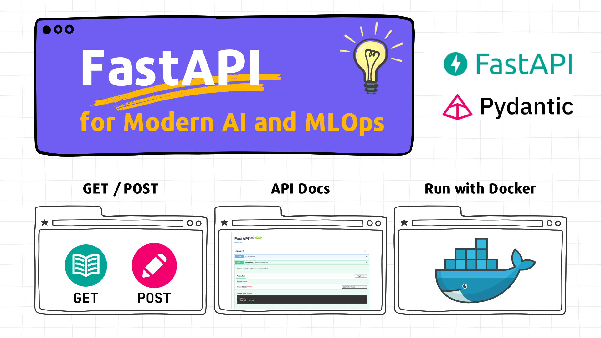

# 🚀 FastAPI Basics for Modern AI and MLOps

{width="800"}

Welcome to the example project for the "FastAPI Basics for Modern AI and MLOps" tutorial! This repository contains the **Birthday Gift Predictor**, a simple FastAPI-based web application.

It's designed to:

- Suggest unique and personalized gift ideas based on user's age and interests.
- Utilize a JSON-based "model" for its suggestions.
- Serve as a foundational example of how FastAPI can be used to build and serve AI/ML model APIs.

This README provides quick setup and run instructions. For the full step-by-step guide, please refer to the main tutorial document.

## ⚙️ Prerequisites

Before you begin, ensure you have the following:

- **Python 3.9+** installed.
- **`uv` (Python package installer) installed.**
  - If you don't have `uv`, you can typically install it via `pip install uv` or `pipx install uv`. Check the [official `uv` documentation](https://github.com/astral-sh/uv) for other methods.
- **Git** for cloning the repository.
- Basic familiarity with the command line/terminal.

## 👩‍💻 Quick Start: Installation & Setup

Follow these steps to get the Birthday Gift Predictor running locally.

### 1️⃣ Clone the Repository

Get the example code onto your local machine:

```bash
git clone https://github.com/mlrepa/fastapi-for-modern-ai-and-mlops.git 
cd fastapi-for-modern-ai-and-mlops
```

### 2️⃣ Create and Activate Virtual Environment

It's highly recommended to use a virtual environment to manage project dependencies.

Install `uv`:

```bash
# Install uv if you haven't already
curl -LsSf https://astral.sh/uv/install.sh | sh
# Or consult official uv documentation for other installation methods
   ```

Create a virtual environment using `uv`:

```bash
uv venv .venv --python 3.12

# Activate the virtual environment
# On macOS and Linux:
source .venv/bin/activate
# On Windows:
# .\.venv\Scripts\activate
```

> 👉 **Note:** The `uv venv .venv` command creates a virtual environment in a folder named `.venv` within your project directory.

### 3️⃣ Install Dependencies

With the virtual environment activated, install the required Python packages:

```bash
uv pip install -e .

# Or from requirements.txt:
# uv pip install -r requirements.txt

# Install development dependencies (linters, formatters)
# Assuming these are defined in your pyproject.toml under [project.optional-dependencies]
uv pip install -e ".[dev]" 
# Or add them individually:
# uv pip install black mypy ruff
```

## ▶️ Run the Application

Once dependencies are installed, you're ready to launch the FastAPI application.

### 1️⃣ Start the FastAPI Server

Run the Uvicorn server from your project's root directory:

```bash
uvicorn app.gift_predictor:app --reload
```

- `app.gift_predictor:app`: Points to the `app` instance of `FastAPI` within the `gift_predictor.py` file located in the `app` directory.
- `--reload`: Enables auto-reload, so the server automatically restarts if you make code changes (very useful during development).

You should see output in your terminal indicating that Uvicorn is running and the application is available (usually on `http://0.0.0.0:8000`).

### 2️⃣ Access the Application

Open your web browser and navigate to:

```
http://localhost:8000/
```

You should see the Birthday Gift Predictor's homepage.

### 📚 Explore the API Docs

FastAPI automatically generates interactive API documentation. This is a great way to understand and test the available endpoints:

- **Swagger UI:** [http://localhost:8000/docs](http://localhost:8000/docs)
- **ReDoc:** [http://localhost:8000/redoc](http://localhost:8000/redoc)

You can use these interfaces to send requests to the `/predict/` endpoint and see the application in action!

## 🐳 Docker (Optional)

This project also includes a `Dockerfile` to containerize the application. Refer to the main tutorial (Section 5) for detailed instructions on building and running the Docker container.

**Quick Docker Commands (from project root):**

```bash
# 1. Build the Docker image
docker build -t fastapi-gift-predictor .

# 2. Run the Docker container
# (Remove old one if it exists)
# docker rm -f mygiftapp-container
docker run --name mygiftapp-container -p 8000:8000 -d fastapi-gift-predictor
```

The application will then be accessible via Docker at `http://localhost:8000/`.

## 📖 Next Steps

- Dive into the `app/gift_predictor.py` code to see how the FastAPI endpoints, Pydantic models, and "prediction" logic are implemented.
- Follow the main **"FastAPI Basics for Modern AI and MLOps"** tutorial for a detailed walkthrough and explanations of each concept.
- Experiment by modifying the `models/model.json` or adding new features!

Happy coding! 🎉
