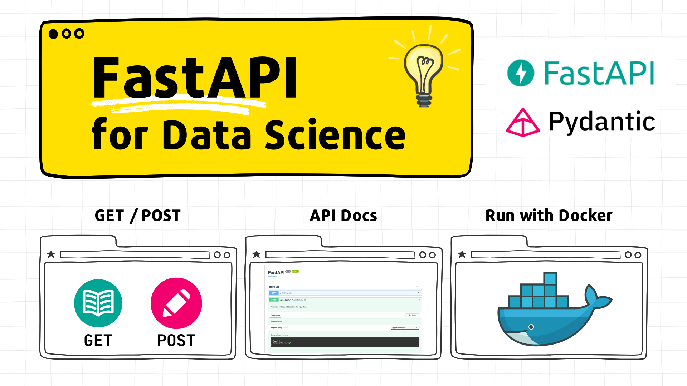
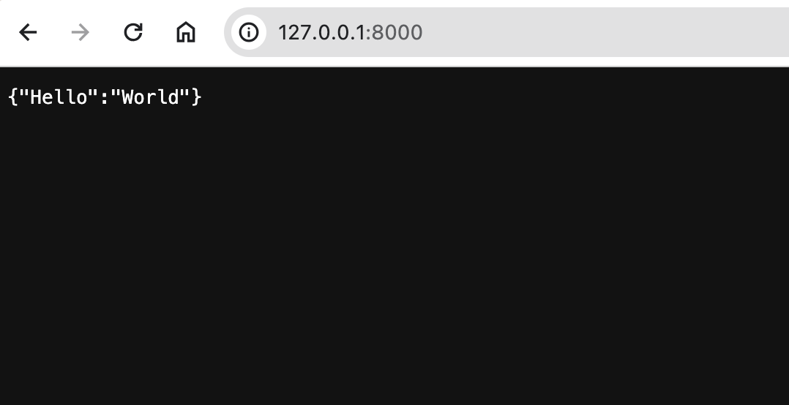
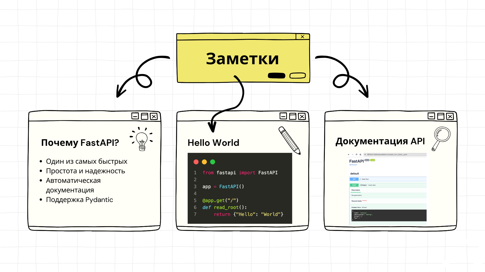

# Тьюториал: Основы FastAPI для Data Science

## 👀 Описание

🎓 **Что это такое?** Тьюториал "Основы FastAPI для Data Science" это целое путешествие в мир создания веб-сервисов на FastAPI, специально для Data Scientists и ML Engineers. Этот тьюториал покажет вам, как легко и быстро можно использовать FastAPI для сервинга ML моделей.

👩🏻‍💻 **Кому это подойдет?** Если вы Data Scientist или начинающий ML инженер, этот тьюториал будет вашим лучшим другом. Здесь вы найдете всё, что нужно для начала работы с FastAPI.

🎯 **Что вы узнаете?**

- Почему FastAPI - ваш выбор для Data Science (плюсы и минусы).
- Основные методы работы с FastAPI, включая GET и POST запросы.
- Как интегрировать обученные ML модели в ваш веб-сервис.
- Локальное тестирование функциональности разработанного веб-сервиса.
- Запуск веб-сервиса FastAPI в Docker контейнере.

🔍 **Как это устроено?** Вам не придется долго искать нужную информацию. Тьюториал содержит исчерпывающие примеры кода и пошаговые инструкции в формате Markdown.

⏱️ **Сколько времени займет?** Всего 30 минут - и вы будете готовы создавать свои веб-сервисы на FastAPI.

---

## 📖 Содержание
- [Тьюториал: Основы FastAPI для Data Science](#тьюториал-основы-fastapi-для-data-science)
  - [👀 Описание](#описание)
  - [📖 Содержание](#-содержание)
  - [👩‍💻 1 - Установка](#-1-установка)
  - [🤔 2 - Почему FastAPI?](#-2-почему-fastapi)
  - [⭐ 2 - Основные методы работы с FastAPI (10 минут)](#-2-основные-методы-работы-с-fastapi-10-минут)
    - [Шаг 1 - Создание простого API с GET Запросом](#шаг-1-создание-простого-api-с-get-запросом)
    - [Шаг 2 - Запуск FastAPI сервиса](#шаг-2-запуск-fastapi-сервиса)
    - [Шаг 3 - Тестирование сервиса](#шаг-3-тестирование-сервиса)
    - [Шаг 4 - Создание API с POST запросом](#шаг-4-создание-api-с-post-запросом)
    - [Шаг 4 - Тестирование POST запроса](#шаг-4-тестирование-post-запроса)
    - [Шаг 5 - Автоматическая документация API](#шаг-5-автоматическая-документация-api)
  - [🛠️ 3 - Интеграция ML модели в FastAPI (10 минут)](#️-3-интеграция-ml-модели-в-fastapi-10-минут)
    - [Шаг 1 - Сохранение модели](#шаг-1-сохранение-модели)
    - [Шаг 2 - Загрузка модели в FastAPI](#шаг-2-загрузка-модели-в-fastapi)
    - [Шаг 3 - Создание эндпоинта для прогнозов модели](#шаг-3-создание-эндпоинта-для-прогнозов-модели)
    - [Шаг 4 - Запуск приложения](#шаг-4-запуск-приложения)
    - [Шаг 5 - Тестирование эндпоинта](#шаг-5-тестирование-эндпоинта)
  - [🚀 4 - Запуск веб-сервиса FastAPI в Docker контейнере](#-4-запуск-веб-сервиса-fastapi-в-docker-контейнере)
    - [Шаг 1 - Проверка Структуры Проекта](#шаг-1-проверка-структуры-проекта)
    - [Шаг 2 - Подготовка Dockerfile](#шаг-2-подготовка-dockerfile)
    - [Шаг 3 - Сборка Docker-образа](#шаг-3-сборка-docker-образа)
    - [Шаг 4 - Запуск Docker-контейнера](#шаг-4-запуск-docker-контейнера)
  - [🔗 Дополнительные ресурсы](#-дополнительные-ресурсы)


## 👩‍💻 1 - Установка

Сначала установите готовый пример. Для получения более подробной технической информации и примечаний обратитесь к оригинальному файлу README.

**1. Сделайте форк / Клонируйте этот репозиторий**

Клонируйте репозиторий с примером кода. Этот репозиторий предоставляет необходимые файлы и скрипты для тьюториала.

```bash
git clone https://gitlab.com/risomaschool/tutorials-raif/fastapi-1-for-ml.git 
cd fastapi-1-for-ml
```

**2. Создайте виртуальное окружение** 

Для запуска примеров тьюториала нужен Python 3.9 или выше.

```bash
python3 -m venv .venv
source .venv/bin/activate
pip install -r requirements.txt
```

## 🤔 2 - Почему FastAPI? 

FastAPI — это современный, быстрый (высокопроизводительный) веб-фреймворк для создания API используя Python 3.8+, в основе которого лежит стандартная аннотация типов Python.

Некоторые особенности:

- **Скорость**: Очень высокая производительность. [Один из самых быстрых фреймворков Python](https://fastapi.tiangolo.com/ru/#_10).
- **Быстрота разработки**: Увеличьте скорость разработки примерно на 200–300%.
- **Интуитивно понятный**: Отличная поддержка редактора.  везде. Меньше времени на отладку.
- **Надежность**: Получите готовый к работе код. С автоматической интерактивной документацией.
- **На основе стандартов**: Основан на открытых стандартах API и полностью совместим с ними: [OpenAPI](https://github.com/OAI/OpenAPI-Specification) (ранее известном как Swagger) и [JSON Schema](https://json-schema.org/).

## ⭐ 2 - Основные методы работы с FastAPI (10 минут)

В этом разделе вы научитесь создавать базовый веб-сервис с использованием GET и POST запросов в FastAPI и поймете основные декораторы и функции фреймворка.

### Шаг 1 - Создание простого API с GET Запросом

Создайте файл `main.py` со следующим содержимым:

```bash
from fastapi import FastAPI

app = FastAPI()

@app.get("/")
def read_root():
    return {"Hello": "World"}
```

Этот код создает базовый веб-сервис, который отвечает на GET запрос к корневому URL (`"/"`) фразой "Hello World".

### Шаг 2 - Запуск FastAPI сервиса

Теперь, откройте терминал, перейдите в директорию, в которой находит файл `main.py` и запустите сервер с помощью команды:

```bash
uvicorn main:app --reload
```

Разберем из чего состоит эта команда: 

- `main`: файл `main.py` (модуль Python)
- `app`: объект, созданный внутри `main.py` с помощью строки `app = FastAPI()`
- `--reload`: аргумент для перезапуска сервера после изменения кода (удобно во время разработки)

### Шаг 3 - Тестирование сервиса

Откройте браузер и перейдите по адресу `http://localhost:8000/`. Вы должны увидеть ответ `{"Hello": "World"}`.

{width=800}

### Шаг 4 - Создание API с POST запросом

Теперь добавим функционал для обработки POST запросов.

Обновите `main.py`, добавив следующий код

```python
from fastapi import FastAPI
from pydantic import BaseModel

app = FastAPI()

class Item(BaseModel):
    name: str
    description: str = None
    price: float
    tax: float = None

@app.get("/")
def read_root():
    return {"Hello": "World"}

@app.post("/items/")
def create_item(item: Item):
    return item
```

Здесь мы создаем класс `Item`, который будет использоваться для валидации данных, отправляемых в POST запросе.

> ⚠️ Обратите внимение на основные декораторы и функций FastAPI:
>
> - `@app.get("/")` и `@app.post("/")`: Это декораторы, которые определяют функции для обработки GET и POST запросов соответственно.
> - `def read_root()` и `def create_item(item: Item)`: Это функции, которые выполняются при получении соответствующего HTTP запроса.
> - `class Item(BaseModel)`: Pydantic модель данных, которая используются для валидации и документирования тела запроса.

### Шаг 4 - Тестирование POST запроса

Вы можете использовать инструменты, такие как Postman или curl, для отправки POST запроса:

```bash
curl -X 'POST' \
  'http://localhost:8000/items/' \
  -H 'accept: application/json' \
  -H 'Content-Type: application/json' \
  -d '{
    "name": "Sample Item",
    "description": "This is a sample item",
    "price": 15.99,
    "tax": 1.5
    }'

```

### Шаг 5 - Автоматическая документация API

Одна из классных фичей FastAPI - автоматическая документация по API! 

Перейдите на [http://127.0.0.1:8000/docs](http://127.0.0.1:8000/docs). Вы увидите автоматическую интерактивную документацию API (предоставленную [Swagger UI](https://github.com/swagger-api/swagger-ui)):

{width=800}

А теперь перейдите на [http://127.0.0.1:8000/redoc](http://127.0.0.1:8000/redoc). Вы увидите альтернативную автоматическую документацию (предоставленную [ReDoc](https://github.com/Rebilly/ReDoc)):

{width=800}

## 🛠️ 3 - Интеграция ML модели в FastAPI (10 минут)

> 💡 В этом разделе вы будете использовать код из приложения  `app/gift_predictor.py`

Сейчас мы переходим к одному из самых захватывающих этапов: интеграции обученной ML модели в веб-сервис FastAPI. Этот процесс не только удивительно прост, но и крайне важен для того, чтобы твои ML-разработки были доступны миру. Давай приступим! 

### Шаг 1 - Сохранение модели

Первый шаг - сохранение твоей ML модели в формате, который можно будет легко загрузить в FastAPI. Для примера в тьюториале будем использовали JSON для хранения данных о подарках и интересах. Это удобный способ хранения статических данных, который легко интегрируется в Python-приложения. Для простоты будем использовать модель сохраненную в JSON.

Путь к модели: `models/model.json`

### Шаг 2 - Загрузка модели в FastAPI

Теперь, когда у нас есть модель, мы можем загрузить ее непосредственно в FastAPI приложение:

```python
with open('models/model.json', 'r') as json_file:
    model = json.load(json_file)
```

Этот код загружает данные из JSON-файла в переменную `model`, которую мы будем использовать для получения прогнозов.

### Шаг 3 - Создание эндпоинта для прогнозов модели

Эндпоинт – это место в API, куда пользователи могут обращаться за рекомендациями. В нашем случае это POST-запрос, который принимает возраст и интересы:

```python
@app.post("/predict/")
def predict_birthday_gift(input_data: PredictionInput):
    ...
```

Код внутри этой функции обрабатывает входные данные, запрашивает модель и возвращает рекомендуемый подарок.

Итоговый код приложения с эндпоинтом `/predict`, который принимает JSON с данными и возвращает прогноз:

```python
from fastapi import FastAPI
from fastapi.responses import HTMLResponse
import json
from pydantic import BaseModel
import random

app = FastAPI()

# Load the model from the JSON file
with open('models/model.json', 'r') as json_file:
    model = json.load(json_file)

class PredictionInput(BaseModel):
    """
    Represents the input data for predicting a birthday gift.
    """
    age: int
    interest: str

@app.get("/", response_class=HTMLResponse)
def get_interests():
    """
    Returns the available interests for selecting a birthday gift.
    """
    interests = list(model["interests"].keys())
    interests_str = '</li>\n  <li>'.join(interests)

    return f"""
        <html>
            <head>
                <title>Birthday Gift Predictor</title>
            </head>
            <body>
                <h1>Birthday Gift Predictor</h1>
                <h2>Wanna cool gift for the next birthday?</h2>
                <p>Just let me know your <b>Age</b> and one of the <b>Interests</b>.</p>
                
                <p>Available interests are:</p>
                <ul>
                    <li>{interests_str}</li>
                </ul>
            </body>
        </html>
    """

@app.post("/predict/")
def predict_birthday_gift(input_data: PredictionInput):
    """
    Predicts a birthday gift based on the input data.
    """
    age = input_data.age
    interest = input_data.interest.lower()

    primary_gift = model["gifts_by_age"].get(str(age), "Special Surprise Gift")
    specif_gift = model['interests'].get(interest, '')
    prob = random.randint(50, 100)
    gift = f"{primary_gift} and {specif_gift}" if specif_gift else primary_gift

    return f"predicted_gift: {gift} with probability {prob}%"

if __name__ == "__main__":
    uvicorn.run(app, host="0.0.0.0", port=8000)
```

### Шаг 4 - Запуск приложения

Запустим приложение стандартным способом: 

```bash
uvicorn app.gift_predictor:app --reload
```

{width=800}

### Шаг 5 - Тестирование эндпоинта

После создания эндпоинта его необходимо протестировать. Запустии FastAPI приложение, и отправим POST-запрос на `/predict/` с JSON-данными. Это поможет убедиться, что эндпоинт корректно обрабатывает запросы и возвращает правильные прогнозы.

```bash
curl -X 'POST' \
  'http://localhost:8000/predict/' \
  -H 'accept: application/json' \
  -H 'Content-Type: application/json' \
  -d '{
    "age": 25,
    "interest": "data"
    }'
```

То же самое можно сделать через web интерфейс!

- Откройте  [`http://127.0.0.1:8000/docs`](http://127.0.0.1:8000/docs)

{width=800}

- Укажите `age`  и `interest`

{width=800}

- Получите прогноз и добавьте в свой Список желаний! 🎁

{width=800}

Интересно какой будет результат? Запустите сервис и узнайте! 😎

## 🚀 4 - Запуск веб-сервиса FastAPI в Docker контейнере

Чтобы запустить приложение FastAPI в Docker, необходимо собрать Docker Image (образ) и использовать его для запуска Docker-контейнера с приложением. 

Для сборки Docker образа обычно используют конфигурационнный файл - `Dockerfile`. 
Давайте создадим его!

### Шаг 1 - Проверка Структуры Проекта

Убедитесь, что структура проекта выглядит примерно так:

```yaml
fastapi-1-for-ml/
│
├── app/
│   └── git_predictor.py  # FastAPI приложение
│
├── models/
│   └── model.json        # Файл модели
│
├── Dockerfile
└── requirements.txt

```

### Шаг 2 - Подготовка Dockerfile

Создайте файл с именем `Dockerfile` в корневой директории проекта со следующим содержанием:

```docker
# Используем официальный образ Python как базовый
FROM python:alpine3.18

# Устанавливаем рабочую директорию в контейнере
WORKDIR /app

# Копируем файлы зависимостей и устанавливаем их
COPY requirements.txt .
RUN pip install --no-cache-dir -r requirements.txt

# Копируем остальные файлы проекта в контейнер
COPY . .

# Задаем команду для запуска приложения
CMD ["uvicorn", "app.gift_predictor:app", "--host", "0.0.0.0", "--port", "8000"]

```

Этот `Dockerfile` начинается с базового образа Python, устанавливает зависимости из `requirements.txt`, копирует файлы проекта в контейнер и запускает сервер Uvicorn при старте контейнера.

### Шаг 3 - Сборка Docker-образа

Соберем Docker контейнер для нашего приложения FastAPI. Это позволит развернуть приложение в изолированной среде, что упростит его запуск и развертывание.

Откройте терминал и перейдите в директорию, где находится `Dockerfile`. Затем выполните следующую команду для сборки Docker-образа:

```bash
docker build -t birthday-gift-predictor .

```

### Шаг 4 - Запуск Docker-контейнера

После успешной сборки образа запусти контейнер, используя следующую команду:

```bash
docker run --name mygiftapp -p 8000:8000 birthday-gift-predictor
```

Удалите старый контейнер, если он существует:

```bash
docker rm -f mygiftapp
```

Эта команда запустит контейнер в фоновом режиме (`-d`), присвоит ему имя `mygiftapp` и пробросит порт 8000 для доступа к приложению.

Теперь приложение доступно по адресу `http://localhost:8000/`.

Для тестирования сервиса, можно использовать те же способы и примеры запросов из предыдущего раздела тьюториала.

```bash
curl -X 'POST' \
  'http://localhost:8000/predict/' \
  -H 'accept: application/json' \
  -H 'Content-Type: application/json' \
  -d '{
    "age": 25,
    "interest": "data"
    }'
```

Этот простой пример покзывает как лего можно запустить FastAPI приложение Docker контейнере.

Поздравляю с завершением тьюториала! 🥳 Вы только что интегрировали свою ML модель в FastAPI, создав функциональный эндпоинт для прогнозов. Это не просто крутой способ демонстрации твоих навыков, но и шаг к созданию реальных продуктов на основе машинного обучения. Приятного кодинга! 🚀👩‍💻👨‍💻

> Если рекомендованный подарок 🎁 вам по душе - добавьте его в список желаний, или сразу купите! Вы этого заслуживаете! 🤗

## 🔗 Дополнительные ресурсы

- [Документация FastAPI](https://fastapi.tiangolo.com/ru/#_5)




[⬆️ Содержание](#-содержание)