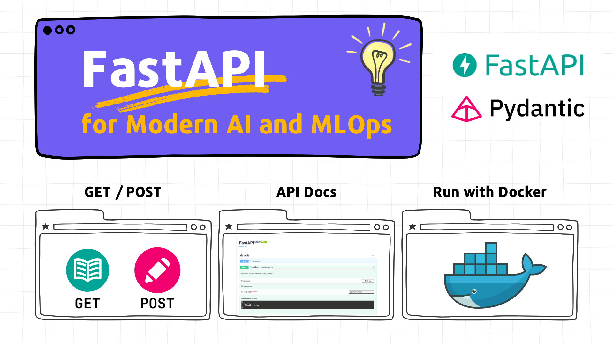

{width="800"}

# 🚀 Tutorial: FastAPI Basics for Modern AI and MLOps

## 👀 Description

🎓 **What is this?** The "FastAPI Basics for Modern AI and MLOps" tutorial is your comprehensive journey into building web services with FastAPI, specially designed for Data Scientists and ML Engineers. This tutorial will show you how easily and quickly you can use FastAPI to build robust, high-performance APIs to serve your ML models and integrate them into larger MLOps workflows.

👩‍💻 **Who is this for?** If you're a Data Scientist, ML Engineer, or anyone looking to deploy machine learning models as scalable web services, this tutorial is for you. It covers the essentials to get you started quickly and effectively.

🎯 **What will you learn?**

- Why FastAPI is an excellent choice for serving ML models in AI/MLOps (performance, data validation, ease of use).
- Core FastAPI concepts: path operations (GET, POST), request/response handling.
- Leveraging Pydantic for defining clear data contracts and robust input/output validation for your models.
- Integrating trained ML models (using a simplified example) into your FastAPI service.
- Locally testing your API endpoints, including using the interactive documentation.
- Containerizing your FastAPI application with Docker for consistent deployment.

🔍 **How is it structured?** Clear, step-by-step instructions with comprehensive code examples in Markdown format. You'll build up from a simple "Hello World" to a containerized ML model serving application.

⏱️ **How much time will it take?** Approximately **45-60 minutes** – giving you a solid foundation to build and deploy your own ML-powered APIs.

---

## 📖 Table of Contents

- [🚀 Tutorial: FastAPI Basics for Modern AI and MLOps](#-tutorial-fastapi-basics-for-modern-ai-and-mlops)
  - [👀 Description](#-description)
  - [📖 Table of Contents](#-table-of-contents)
  - [⚙️ 1 - Prerequisites & Installation](#️-1---prerequisites--installation)
  - [🤔 2 - Why FastAPI for AI & MLOps?](#-2---why-fastapi-for-ai--mlops)
  - [⭐ 3 - Core FastAPI: GET & POST Requests (10 minutes)](#-3---core-fastapi-get--post-requests-10-minutes)
    - [Step 1: Create a Simple API with a GET Request](#step-1-create-a-simple-api-with-a-get-request)
    - [Step 2: Run the FastAPI Service](#step-2-run-the-fastapi-service)
    - [Step 3: Test the Service](#step-3-test-the-service)
    - [Step 4: Create an API with a POST Request (Introducing Pydantic)](#step-4-create-an-api-with-a-post-request-introducing-pydantic)
    - [Step 5: Test the POST Request](#step-5-test-the-post-request)
    - [Step 6: Automatic API Documentation](#step-6-automatic-api-documentation)
  - [🛠️ 4 - Integrating an ML Model with FastAPI (15 minutes)](#️-4---integrating-an-ml-model-with-fastapi-15-minutes)
    - [Step 1: The "Model" - A Simplified Example](#step-1-the-model---a-simplified-example)
    - [Step 2: Loading the Model at Application Startup](#step-2-loading-the-model-at-application-startup)
    - [Step 3: Defining Input/Output Data Structures with Pydantic](#step-3-defining-inputoutput-data-structures-with-pydantic)
    - [Step 4: Creating an Endpoint for Model Predictions](#step-4-creating-an-endpoint-for-model-predictions)
    - [Step 5: Running the Full Application](#step-5-running-the-full-application)
    - [Step 6: Testing the Prediction Endpoint](#step-6-testing-the-prediction-endpoint)
  - [🐳 5 - Running Your FastAPI Web Service in a Docker Container (15 minutes)](#-5---running-your-fastapi-web-service-in-a-docker-container-15-minutes)
    - [Step 1: Verify Project Structure](#step-1-verify-project-structure)
    - [Step 2: Prepare the Dockerfile (with `uv`)](#step-2-prepare-the-dockerfile-with-uv)
    - [Step 3: Build the Docker Image](#step-3-build-the-docker-image)
    - [Step 4: Run the Docker Container](#step-4-run-the-docker-container)
  - [🧪 6 - Pydantic Power-Up: Advanced Validation (10 minutes)](#-6---pydantic-power-up-advanced-validation-10-minutes)
    - [Python Type Annotations: A Quick Refresher](#python-type-annotations-a-quick-refresher)
    - [Pydantic Basics Recap](#pydantic-basics-recap)
    - [Advanced Validation with `Field`](#advanced-validation-with-field)
    - [Custom Logic with Field Validators (`@field_validator`)](#custom-logic-with-field-validators-field_validator)
    - [Reusable Validations with `typing.Annotated`](#reusable-validations-with-typingannotated)
  - [🔗 7 - Additional Resources](#-7---additional-resources)
  - [🎉 8 - Next Steps & Conclusion](#-8---next-steps--conclusion)

---

## ⚙️ 1 - Prerequisites & Installation

Before we dive in, let's ensure your environment is ready.

**0. Prerequisites:**
- **Python 3.9+ installed.** (FastAPI supports 3.8+, but newer versions are recommended).
- **`uv` (Python package installer) installed.** `uv` is a fast, modern package manager.
  - If you don't have `uv`, install it: `pip install uv` (or `pipx install uv`). Refer to the [official `uv` documentation](https://github.com/astral-sh/uv) for more installation options.
- **Basic understanding of Python** and the command line/terminal.
- **Basic understanding of web concepts** (HTTP methods like GET/POST, what an API is).
- **Docker installed** (for the Docker containerization section).

Please follow the [Quick Start: Installation & Setup](README.md#-quick-start-installation--setup) section in the README to set up your development environment. This will guide you through:

1. Cloning the repository
2. Creating and activating a virtual environment
3. Installing the required dependencies

---

## 🤔 2 - Why FastAPI for AI & MLOps?

FastAPI has rapidly become a favorite for building APIs, especially for serving machine learning models in MLOps pipelines. Here's why:

- 🚀 **High Performance:** FastAPI is built on Starlette (for web parts) and Pydantic (for data parts), and uses ASGI servers like Uvicorn, making it one of the fastest Python frameworks. **Low latency is critical for real-time ML model inference.**
- 🛡️ **Robust Data Validation with Pydantic:** Python type hints are used with Pydantic to define clear, validated data schemas for your requests and responses. This means:
  - **Clear Data Contracts:** Your ML model's expected input features and output structure are explicitly defined. This is vital for seamless integration in an MLOps pipeline where different services interact.
  - **Reduced Runtime Errors:** Invalid data is caught early with descriptive errors before it even reaches your model logic.
- ⏱️ **Rapid Development:** Intuitive syntax, great editor support (autocompletion!), and less boilerplate code mean you can develop, test, and iterate on your ML APIs much faster.
- 📚 **Automatic Interactive Documentation:** FastAPI automatically generates OpenAPI (Swagger UI) and ReDoc documentation from your code. This makes it incredibly easy for your team or other services to understand, test, and integrate with your ML API.
- 🧩 **Asynchronous Support (`async`/`await`):** Natively supports asynchronous code, which is beneficial for I/O-bound operations that might be part of your pre/post-processing logic around the model inference step.
- 🌐 **Standards-Based:** Adheres to open standards like OpenAPI and JSON Schema.
- 🏢 **Microservice Friendly:** Its lightweight nature and focus make it ideal for building ML models as independent microservices within a larger MLOps architecture.

In short, FastAPI helps you build production-ready, maintainable, and performant APIs for your AI/ML models with less effort.

---

## ⭐ 3 - Core FastAPI: GET & POST Requests (10 minutes)

Let's start with the fundamentals of creating API endpoints.

### Step 1: Create a Simple API with a GET Request

Create a file named `main_step3.py` (we'll create new files for steps to keep them distinct):

```python
# main_step3.py
from fastapi import FastAPI

app = FastAPI(title="My First FastAPI App")

@app.get("/") # Path operation decorator for GET requests to the root path
async def read_root(): # Path operation function (can be async or sync)
    return {"message": "Hello from FastAPI!"}
```

### Step 2: Run the FastAPI Service

Open your terminal, navigate to the directory with `main_step3.py`, and run:

```bash
uvicorn main_step3:app --reload
```

* `main_step3`: The Python file.
- `app`: The `FastAPI` instance inside `main_step3.py`.
- `--reload`: For auto-restarting the server on code changes during development.

### Step 3: Test the Service

Open your browser and go to `http://localhost:8000/`. You should see:

```json
{"message":"Hello from FastAPI!"}
```

### Step 4: Create an API with a POST Request (Introducing Pydantic)

POST requests are typically used to send data to the server to create or update resources. FastAPI uses **Pydantic** models to define the structure and validate this incoming data.

Create `main_step4.py`:

```python
# main_step4.py
from fastapi import FastAPI
from pydantic import BaseModel # Import BaseModel from Pydantic

app = FastAPI(title="FastAPI with POST")

# 1. Define a Pydantic model for the request body
class Item(BaseModel):
    name: str
    description: str | None = None  # Python 3.10+ for `| None`, or use `Optional[str]`
    price: float
    is_offer: bool | None = None

@app.get("/")
async def read_root():
    return {"message": "Send data to /items/ via POST!"}

# 2. Create a POST endpoint
@app.post("/items/") # Handles POST requests to /items/
async def create_item(item: Item): # FastAPI validates incoming data against the Item model
    # 'item' is now an instance of Item, with validated data
    return {"item_name": item.name, "item_price": item.price, "description": item.description}
```

* **Pydantic `BaseModel`:** We define `Item` inheriting from `pydantic.BaseModel`. Its attributes with type hints define the expected JSON structure.
- **Type Hinting:** `item: Item` in `create_item` tells FastAPI to expect a request body matching the `Item` model. FastAPI handles parsing the JSON, validating it, and converting it to an `Item` object. If validation fails, FastAPI automatically returns a 422 error.

### Step 5: Test the POST Request

Stop the previous server (Ctrl+C) and run the new one:

```bash
uvicorn main_step4:app --reload
```

Use `curl` (or Postman/Insomnia) to send a POST request:

```bash
curl -X POST "http://localhost:8000/items/" \
     -H "Content-Type: application/json" \
     -d '{
           "name": "Super Gadget",
           "price": 49.99,
           "description": "An amazing new gadget for all your needs"
         }'
```

**Expected Response:**

```json
{"item_name":"Super Gadget","item_price":49.99,"description":"An amazing new gadget for all your needs"}
```

Try sending invalid data (e.g., `price` as a string) to see FastAPI's automatic 422 validation error!

### Step 6: Automatic API Documentation

FastAPI automatically generates interactive API documentation. With `main_step4.py` running:
- **Swagger UI:** Open `http://localhost:8000/docs`
- **ReDoc:** Open `http://localhost:8000/redoc`

You can see your `/` (GET) and `/items/` (POST) endpoints, including the expected request body schema for `/items/` derived from the `Item` Pydantic model. You can even "Try it out" directly from Swagger UI!

---

## 🛠️ 4 - Integrating an ML Model with FastAPI (15 minutes)

Let's integrate a "model" into FastAPI. For this tutorial, we'll use the simplified `gift_predictor.py` example.

### Step 1: The "Model" - A Simplified Example

Our "ML model" for this tutorial is a JSON file (`models/model.json`) that acts as a lookup table for gift suggestions.

> 👉 **Real-World Model Persistence:**
> This JSON file is a stand-in for a real ML model. In practice, you would:
>
> 1. **Train your model** using scikit-learn, TensorFlow, PyTorch, etc.
> 2. **Save (serialize) the trained model** to a file:
>     - `joblib.dump(model, 'model.joblib')` for scikit-learn.
>     - `model.save('tf_model_directory')` for TensorFlow.
>     - `torch.save(model.state_dict(), 'pytorch_model.pth')` for PyTorch.
>     - Or use ONNX for a framework-agnostic format.
> The principles of loading this saved model at FastAPI startup and using it in your prediction endpoint remain the same.

### Step 2: Loading the Model at Application Startup

It's crucial to load your ML model **once** when the FastAPI application starts, not on every request, to avoid performance bottlenecks. We do this by loading it into a global variable in `app/gift_predictor.py`.

```python
# app/gift_predictor.py (excerpt)
import json
from fastapi import FastAPI, HTTPException # Import HTTPException

app = FastAPI(title="Birthday Gift Predictor API", version="1.0.0")

MODEL_PATH = "models/model.json"
model_data = None # Initialize as None

try:
    with open(MODEL_PATH, 'r') as f:
        model_data = json.load(f)
    print(f"Successfully loaded model data from {MODEL_PATH}")
except FileNotFoundError:
    print(f"ERROR: Model file not found at {MODEL_PATH}. API will not function correctly.")
    # In a real app, you might want the app to not start or have a health check fail.
except json.JSONDecodeError:
    print(f"ERROR: Could not decode JSON from {MODEL_PATH}. File might be corrupted.")
```

This code attempts to load the JSON data. If it fails, it prints an error. A real application would have more robust error handling or health checks.

### Step 3: Defining Input/Output Data Structures with Pydantic

Clear data contracts are essential. We define Pydantic models for the input to our prediction endpoint and for its output.

```python
# app/gift_predictor.py (continued)
from pydantic import BaseModel, Field # Import Field for more detailed validation

class PredictionInput(BaseModel):
    age: int = Field(..., gt=0, le=120, description="User's age (1-120)") # ... means required
    interest: str = Field(..., min_length=2, max_length=30, description="User's primary interest")

class PredictionOutput(BaseModel):
    predicted_gift: str
    suggested_category: str
    confidence_score: float | None = Field(None, ge=0, le=1, description="Model's confidence (0.0-1.0)")
```

* `Field(..., gt=0, le=120)`: `...` makes `age` required. `gt` (greater than) and `le` (less than or equal to) provide validation.
- `response_model=PredictionOutput` will be used in our endpoint to define and validate the structure of the response.

### Step 4: Creating an Endpoint for Model Predictions

Now, the core prediction logic within a FastAPI path operation.

```python
# app/gift_predictor.py (continued)
import random # For dummy confidence

@app.post("/predict/", response_model=PredictionOutput, tags=["Predictions"])
async def predict_birthday_gift(payload: PredictionInput): # Use 'payload' for clarity
    if model_data is None:
        raise HTTPException(status_code=503, detail="Model not loaded. Service unavailable.")

    age_str = str(payload.age)
    interest_lower = payload.interest.lower()

    # Simplified "prediction" logic using the loaded JSON
    primary_gift = model_data.get("gifts_by_age", {}).get(age_str, "A thoughtful surprise")
    interest_category = model_data.get("interests", {}).get(interest_lower, "General Interest")
    
    final_gift_suggestion = f"{primary_gift} related to {interest_category}."
    if interest_category == "General Interest" and primary_gift == "A thoughtful surprise":
        final_gift_suggestion = "A very special and unique surprise, just for you!"
        
    # Dummy confidence score
    confidence = round(random.uniform(0.65, 0.98), 2)

    return PredictionOutput(
        predicted_gift=final_gift_suggestion,
        suggested_category=interest_category,
        confidence_score=confidence
    )

# Add a simple HTML home page (optional, but nice for users)
from fastapi.responses import HTMLResponse
@app.get("/", response_class=HTMLResponse, include_in_schema=False) # Hides from API docs
async def home():
    return """
    <html>
        <head><title>Gift Predictor API</title></head>
        <body>
            <h1>🎁 Birthday Gift Predictor API</h1>
            <p>Welcome! Use the <a href="/docs">/docs</a> endpoint to try the API.</p>
        </body>
    </html>
    """
```

* **Error Handling:** If `model_data` isn't loaded, we raise an `HTTPException` with a 503 status.
- **`response_model=PredictionOutput`:** FastAPI will validate that the dictionary returned by this function matches the `PredictionOutput` schema. If not, it raises an internal server error. It also uses this for the API documentation.

### Step 5: Running the Full Application

Ensure your `app/gift_predictor.py` file contains all these parts. Then run:

```bash
uvicorn app.gift_predictor:app --reload
```

### Step 6: Testing the Prediction Endpoint

**Using `curl`:**

```bash
curl -X POST "http://localhost:8000/predict/" \
     -H "Content-Type: application/json" \
     -d '{"age": 28, "interest": "Programming"}'
```

**Expected Response (example):**

```json
{
  "predicted_gift": "A new tech gadget related to Coding.",
  "suggested_category": "coding",
  "confidence_score": 0.88
}
```

**Or test via Swagger UI at `http://localhost:8000/docs`:**
Expand the `/predict/` endpoint, click "Try it out," enter valid JSON, and execute. You'll see the structured request and response. Try invalid input (e.g., age < 1) to see Pydantic's validation in action (a 422 error).

---

## 🐳 5 - Running Your FastAPI Web Service in a Docker Container (15 minutes)

Containerizing your application with Docker ensures consistency across different environments and simplifies deployment.

### Step 1: Verify Project Structure

A typical structure (ensure `Dockerfile` is at the root):

```plaintext
fastapi-1-for-ml/
├── app/
│   └── gift_predictor.py
├── models/
│   └── model.json
├── Dockerfile
└── requirements.txt
```

### Step 2: Prepare the Dockerfile (with `uv`)

Create/update your `Dockerfile` at the project root:

```dockerfile
# Dockerfile
# Stage 1: Build environment with uv and install dependencies
FROM python:3.11-slim AS builder

# Install uv
RUN pip install --no-cache-dir uv

WORKDIR /opt/venv
COPY requirements.txt .
# Create a virtual environment and install dependencies into it
RUN uv venv .venv && \
    .venv/bin/uv pip install --no-cache-dir -r requirements.txt

# Stage 2: Production image
FROM python:3.11-slim

WORKDIR /app

# Copy the virtual environment from the builder stage
COPY --from=builder /opt/venv/.venv /opt/venv/.venv

# Copy application code
COPY ./app /app/app
COPY ./models /app/models

# Expose port 8000
EXPOSE 8000

# Activate venv and run the application
# The PATH ensures 'uvicorn' from the venv is found
ENV PATH="/opt/venv/.venv/bin:$PATH"
CMD ["uvicorn", "app.gift_predictor:app", "--host", "0.0.0.0", "--port", "8000"]
```

* **Multi-stage build:** The first stage (`builder`) installs `uv` and creates a virtual environment with dependencies. The second stage copies this venv and your app code, resulting in a cleaner final image.
- **`uv` usage:** We now use `uv` inside the Dockerfile to install dependencies.

### Step 3: Build the Docker Image

```bash
docker build -t fastapi-gift-predictor .
```

### Step 4: Run the Docker Container

```bash
# Remove old container if it exists
docker rm -f mygiftapp-container

# Run the new container
docker run --name mygiftapp-container -p 8000:8000 -d fastapi-gift-predictor
```

Your application is now running inside Docker, accessible at `http://localhost:8000/`. Test it as before!

---

## 🧪 6 - Pydantic Power-Up: Advanced Validation (10 minutes)

Pydantic is incredibly powerful for defining precise data validation rules.

### Python Type Annotations: A Quick Refresher

As discussed in "Why FastAPI?", type hints are fundamental. They declare the *expected* type of variables, function parameters, and return values. Pydantic leverages these.

### Pydantic Basics Recap

You've used `BaseModel` to define data structures and `Field` to add basic constraints (e.g., `gt`, `le`, `min_length`).

### Advanced Validation with `Field`

`Field` offers many validation parameters: `max_length`, `pattern` (for regex), `multiple_of`, etc.
Example for an MLOps input model:

```python
from pydantic import BaseModel, Field
from typing import List

class MLFeaturesInput(BaseModel):
    request_id: str = Field(..., pattern=r"^[a-zA-Z0-9_-]{10,30}$") # Regex for ID format
    numerical_features: List[float] = Field(..., min_items=5, max_items=5) # Fixed size list
    categorical_feature: str = Field(..., example="type_A")

# Example usage:
# valid_input = MLFeaturesInput(
#     request_id="req_123_abc_XYZ",
#     numerical_features=[0.1, 0.2, 0.3, 0.4, 0.5],
#     categorical_feature="type_B"
# )
```

### Custom Logic with Field Validators (`@field_validator`)

For complex rules not covered by `Field` arguments:

```python
# In your Pydantic model
from pydantic import field_validator
from pydantic_core.core_schema import ValidationInfo

class UserRegistration(BaseModel):
    username: str = Field(min_length=3)
    password: str = Field(min_length=8)
    confirm_password: str

    @field_validator('confirm_password')
    @classmethod
    def passwords_match(cls, v: str, info: ValidationInfo) -> str:
        # info.data contains all fields validated so far
        if 'password' in info.data and v != info.data['password']:
            raise ValueError('Passwords do not match')
        return v
```

### Reusable Validations with `typing.Annotated`

For complex or reusable validation logic, combine `typing.Annotated` with Pydantic's functional validators. Let's refine the `InterestStr` example for `PredictionInput`:

```python
# In app/gift_predictor.py or a shared models.py
from typing import Annotated
from pydantic.functional_validators import AfterValidator

VALID_INTERESTS_LIST = [ # Define as a constant
    "painting", "reading", "gardening", "gaming", "yoga",
    "fashion", "data", "ml", "programming", "it", "travel", "coding" # Added more
]

def check_and_normalize_interest(value: str) -> str:
    normalized_value = value.strip().lower()
    if normalized_value not in VALID_INTERESTS_LIST:
        raise ValueError(
            f"Invalid interest: '{value}'. Must be one of: {', '.join(VALID_INTERESTS_LIST)}"
        )
    return normalized_value

# Reusable Annotated type
ValidatedInterestStr = Annotated[
    str,
    Field(description=f"User's interest. Must be one of: {', '.join(VALID_INTERESTS_LIST)}"),
    AfterValidator(check_and_normalize_interest)
]

# Update PredictionInput to use this
class PredictionInput(BaseModel): # (from Step 3 in Section 4)
    age: int = Field(..., gt=0, le=120, description="User's age (1-120)")
    interest: ValidatedInterestStr # Use the annotated type
```

Now, `PredictionInput`'s `interest` field will automatically use `check_and_normalize_interest`. If you run `app.gift_predictor:app` and send an invalid interest like `"skydiving"` to `/predict/`, FastAPI will return a 422 error with the custom message from `ValueError`.

---

## 🔗 7 - Additional Resources

- **FastAPI Official Documentation:** [fastapi.tiangolo.com](https://fastapi.tiangolo.com/) - The ultimate source.
- **Pydantic Official Documentation:** [docs.pydantic.dev](https://docs.pydantic.dev/latest/) - Essential for data validation.
- **Uvicorn Official Documentation:** [www.uvicorn.org](https://www.uvicorn.org/) - The ASGI server.
- **TestDriven.io - FastAPI Courses & Articles:** [testdriven.io/courses/fastapi-crud/](https://testdriven.io/courses/fastapi-crud/)
- **RealPython - Python Type Checking Guide:** [realpython.com/python-type-checking/](https://realpython.com/python-type-checking/)

---

## 🎉 8 - Next Steps & Conclusion

Congratulations! You've successfully navigated the basics of FastAPI for AI and MLOps, from simple endpoints to a containerized "ML" service with robust data validation. You now have a strong foundation to build upon.

**Where to go from here?**

- 📦 **Real Model Integration:** Replace the JSON "model" with a real, serialized ML model (scikit-learn, TensorFlow, PyTorch, ONNX).
- 🧪 **Testing:** Implement unit and integration tests for your API using `pytest` and FastAPI's `TestClient`.
- 🔐 **Authentication & Authorization:** Secure your API endpoints (e.g., OAuth2 with JWT tokens).
- ⚙️ **Configuration Management:** Use Pydantic's `BaseSettings` for managing application configurations (e.g., model paths, API keys).
- 📊 **Databases:** Integrate with databases (SQLAlchemy, Tortoise ORM, SQLModel) if your application needs persistence.
- 🔄 **Asynchronous Tasks:** For long-running operations (e.g., complex model inference, batch processing), explore FastAPI's background tasks or integrate with task queues like Celery or RQ.
- 🚀 **Deployment:** Explore advanced deployment options:
  - Kubernetes for orchestration.
  - Serverless platforms (AWS Lambda + API Gateway, Google Cloud Functions/Run).
  - Managed PaaS (Heroku, AWS Elastic Beanstalk).
- 🔗 **MLOps Integration:**
  - Connect with ML experiment tracking tools (e.g., **MLflow**, DVC) for model versioning and lineage.
  - Implement proper logging and monitoring (e.g., Prometheus, Grafana) for your API's performance and model behavior.
  - Consider how your FastAPI service fits into a larger CI/CD pipeline for MLOps.
- 🧩 **Advanced FastAPI:** Explore features like WebSockets, dependencies with `Depends`, middleware, and custom responses.

FastAPI provides the tools to build powerful and efficient APIs. The journey into MLOps involves continuous learning and integration of various tools and practices, and FastAPI is an excellent component in that ecosystem.

Happy building, and may your models always serve with excellence! 🚀

{width="800"}

[⬆️ Back to Table of Contents](#-table-of-contents)
